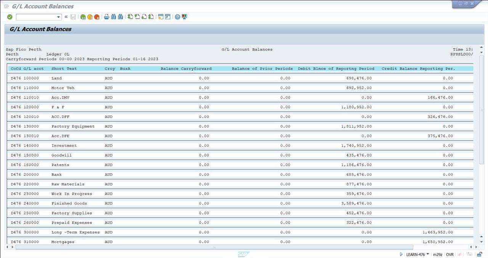
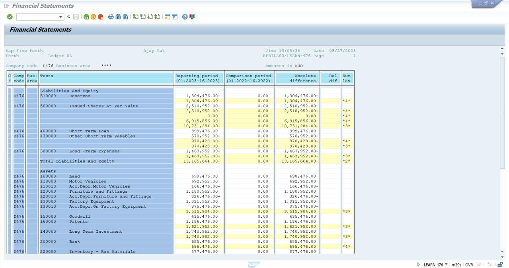

Project Overview

This project demonstrates the use of SAP FICO to generate, analyze, and interpret financial reports, including G/L Account Balances and Financial Statements (Balance Sheet).

The focus is on understanding how financial data is structured in SAP and how it can be used to evaluate an organization’s financial position and performance.

Business Objective

To simulate a real-world financial reporting scenario where SAP is used to:

- Monitor financial transactions at the account level
- Evaluate overall financial position (Assets, Liabilities, Equity)
- Compare financial performance across reporting periods
- Support data-driven financial decision-making
  
System & Environment

- Module: SAP FICO (Financial Accounting)
- Ledger: 0L (Leading Ledger)
- Company Code: D476
- Currency: AUD
- Tool Used: SAP GUI

Process Flow

Step 1: G/L Account Analysis
- Accessed G/L Account Balance report (FS10N)
- Reviewed account-level balances including:
- Fixed Assets (Land, Equipment)
- Inventory (Raw Materials, Finished Goods)
- Bank Accounts
- Analyzed:
- Debit balances (asset increases)
- Credit balances (liabilities/equity impact)
  
Step 2: Financial Statement Generation
- Generated Financial Statement (Balance Sheet report)
- Evaluated:
     Assets: Land, Inventory, Bank, Equipment
     Liabilities: Loans, Payables
     Equity: Reserves, Share Capital
  
Step 3: Comparative Analysis
Compared: Current reporting period vs previous period
Analyzed: Absolute differences in financial values
Identified: Financial growth patterns, Changes in asset/liability distribution

Key Analysis Performed
- Asset Analysis
Identified major contributors to total assets
Evaluated inventory and fixed asset distribution
- Liability & Equity Analysis
Reviewed financial obligations (loans, payables)
Analyzed equity structure (reserves, issued shares)
- Financial Position Evaluation
Interpreted balance sheet structure
Assessed overall financial stability

Key Insights
- High-value assets such as factory equipment and inventory significantly impact financial position
- Financial statement structure provides a clear view of resource allocation and obligations
- Comparative analysis helps in identifying financial trends and performance changes
- SAP enables structured and reliable financial data reporting for decision-making

Project Structure
sap-fico-financial-reporting-analysis/
│── README.md
│── screenshots/
│     ├── gl_account_balances.png
│     ├── financial_statements.png
🖼️ Project Screenshots
G/L Account Balances

Description:
Displays account-wise balances including debit and credit values for assets, inventory, and financial accounts. Used for detailed financial tracking.
###  G/L Account Balances

Financial Statement (Balance Sheet)

Description:
Represents the overall financial position of the organization, including assets, liabilities, and equity, along with period comparisons.
### Financial Statement (Balance Sheet)

Learning Outcomes
- Developed hands-on experience with SAP FICO financial reporting
- Gained understanding of G/L account structure and balance sheet composition
- Learned how to interpret financial data for business insights
- Improved ability to connect SAP outputs with real-world financial analysis
  
Future Enhancements
- Integrate SAP data with Excel for advanced analysis
- Build dashboards for financial visualization
- Automate reporting workflows
  
Conclusion

This project demonstrates how SAP FICO can be used to generate and analyze financial reports, providing valuable insights into an organization’s financial health and supporting effective business decision-making.
